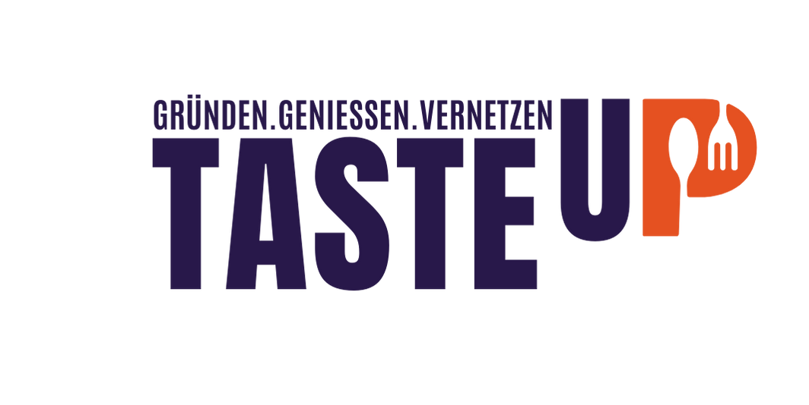

# 📁 Upload Instructions

## For the Food Icons Collage Background

1. **Upload your collage image** to the `images` folder:
   - File name: `food-icons-collage.png` (or .jpg, .svg)
   - Location: `/Users/rashedkabir/Documents/ai/tasteup/images/`
   - This will be used as the hero section background

2. **The HTML file** `index-with-all-changes.html` is already configured to use:
   ```html
   background-image: url('./images/food-icons-collage.png')
   ```

## For the TASTE UP Logo

1. **Upload your logo** to the `images` folder:
   - File name: `tasteup-logo.png` (or .jpg, .svg)
   - Location: `/Users/rashedkabir/Documents/ai/tasteup/images/`
   - This will be used in both header and hero section

2. **The HTML file** is already configured to use:
   ```html
   
   ```

3. **If you want to use a different filename**, just update the path in the HTML file.

## Current Status

✅ **HTML Version Complete:**
- Uses your uploaded collage image as background
- Uses your uploaded logo file (no more CSS logo)
- Speech bubbles with retro style
- Heading below the logo
- Removed unnecessary subtext and image from "Wo, Wann, Was?" section

✅ **React Version Fixed:**
- Fixed import path errors
- Uses your uploaded logo file
- Should now compile and run properly

## Files to Upload

1. **`food-icons-collage.png`** - Your food icons collage for the hero background
2. **`tasteup-logo.png`** - Your TASTE UP logo for header and hero sections

Both files should be placed in: `/Users/rashedkabir/Documents/ai/tasteup/images/`

## Files to View

- **HTML Version**: `index-with-all-changes.html` (use live server)
- **React Version**: `http://localhost:3000` (after uploading collage image)
